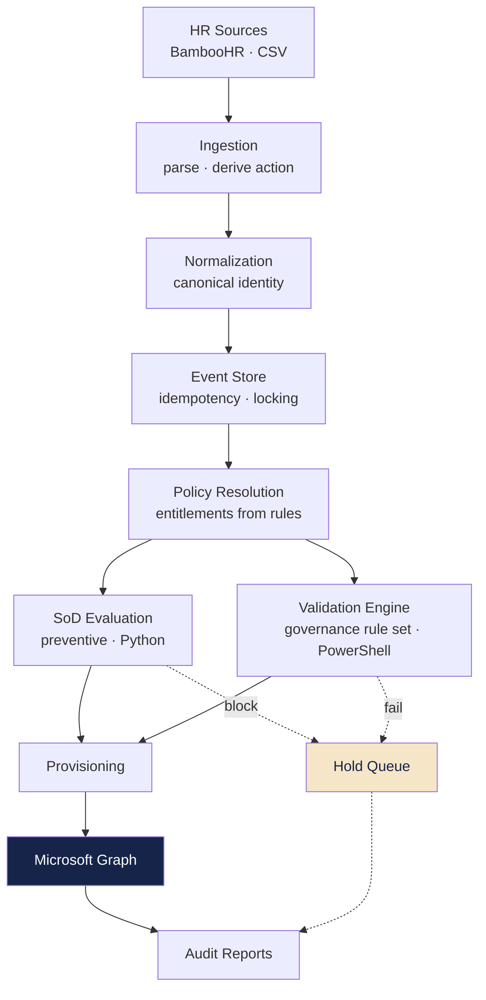
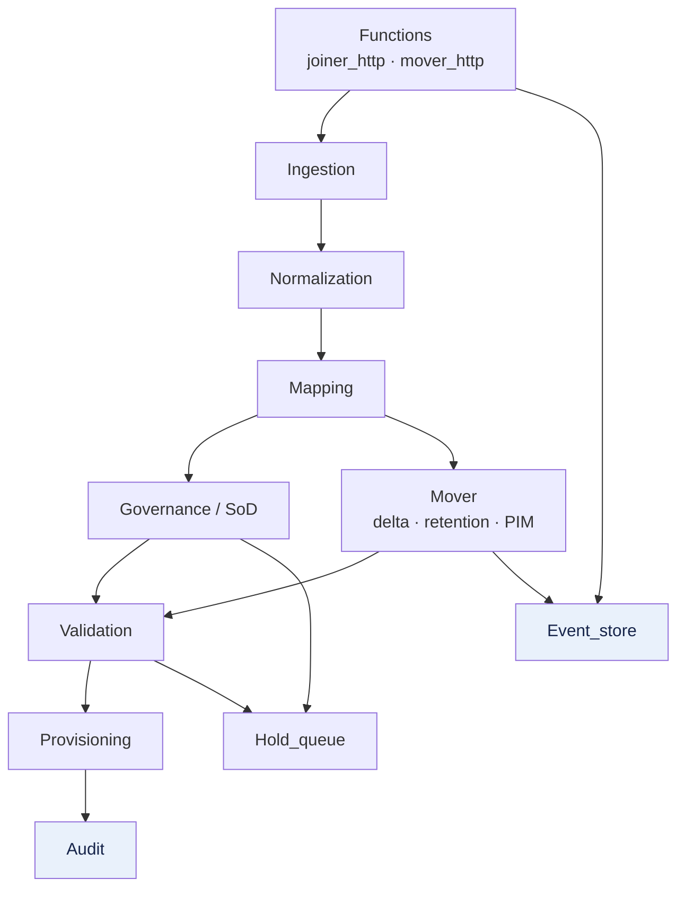
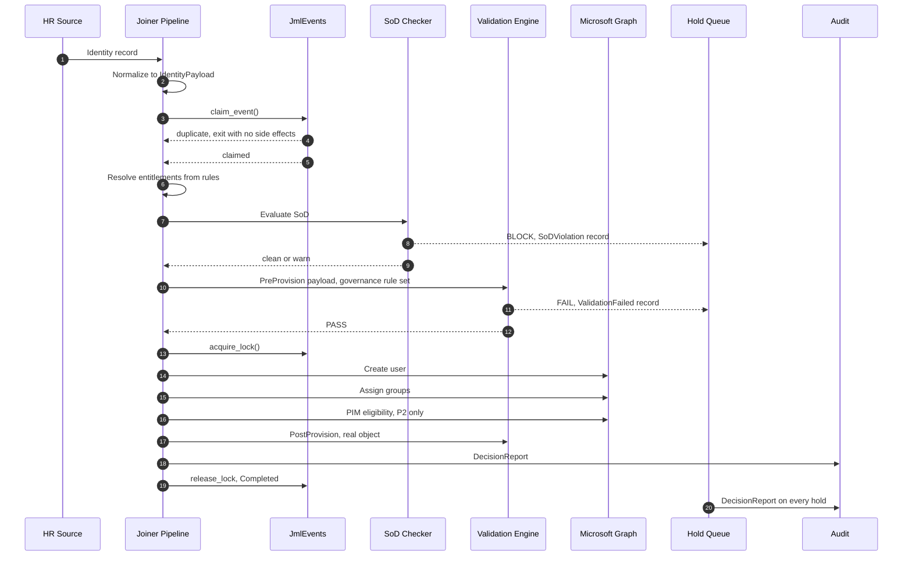
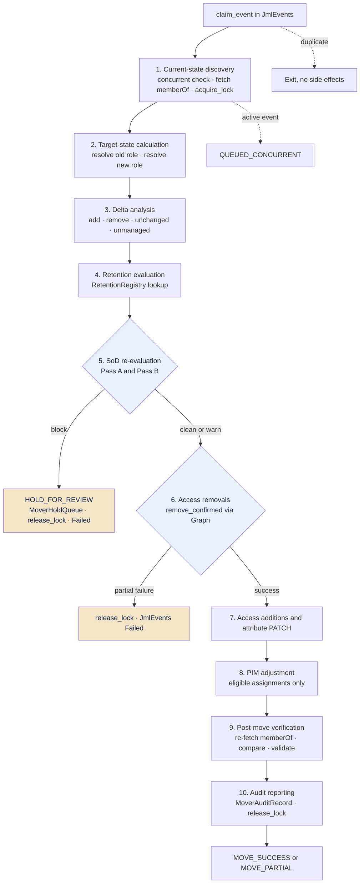
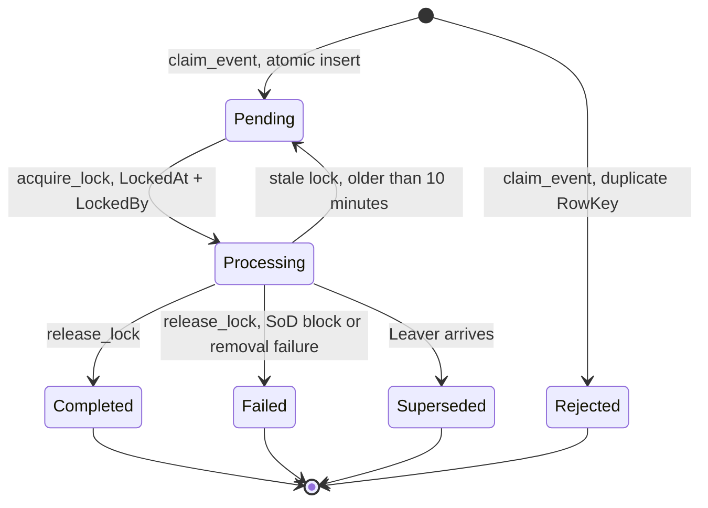
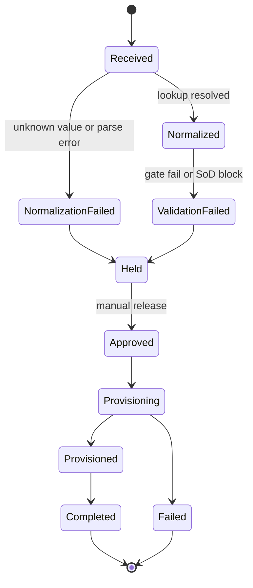
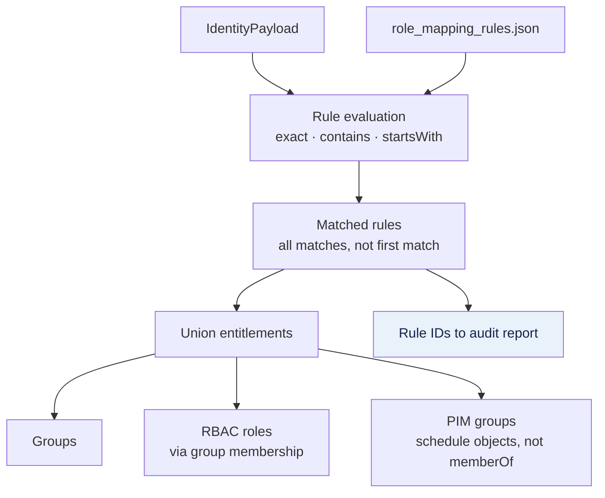
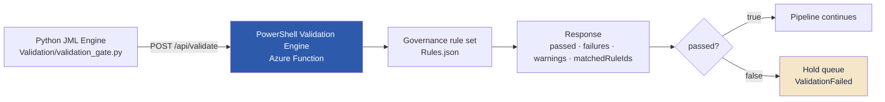
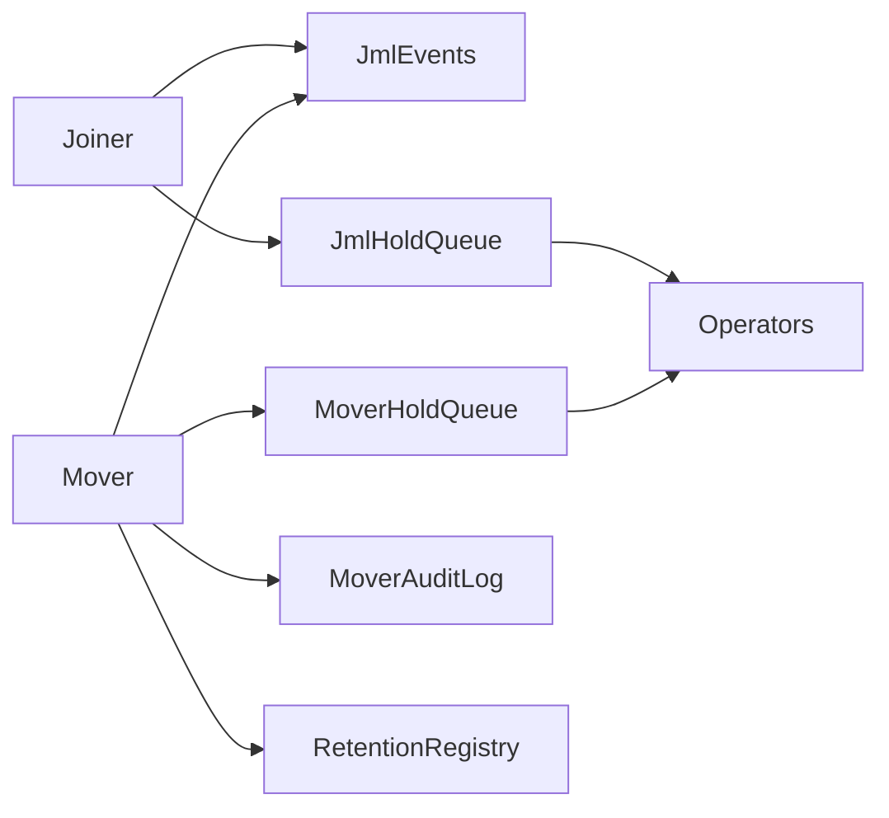
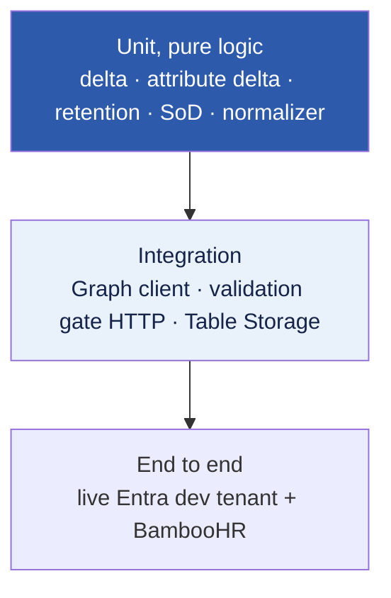

# Developer Guide

Implementation reference for the Policy-Driven Identity Lifecycle Engine. This document covers how the engine is built and how to work on it. For the design rationale see [docs/GOVERNANCE.md](docs/GOVERNANCE.md) and [docs/ADR.md](docs/ADR.md). For the system architecture see [ARCHITECTURE.md](ARCHITECTURE.md).

---

## Overview

The engine has seven layers. Each one has a single responsibility and calls only into the layer below it. Provisioning holds no policy logic, the policy engine makes no Graph calls, and the audit layer makes no provisioning decisions.



SoD and the validation gate both run before provisioning. Either can stop the event. Nothing reaches Microsoft Graph until both pass.

---

## Failure Model

Every stage that can fail routes to one of a small number of outcomes, regardless of which pipeline or which stage triggers it.

| Condition | Outcome |
|---|---|
| Normalization failure | Hold queue, `NormalizationFailed` |
| Governance validation failure | Hold queue, `ValidationFailed` |
| SoD block | Hold queue (Joiner) or `MoverHoldQueue` (Mover), `HOLD_FOR_REVIEW` |
| Provisioning or removal failure | Event marked `Failed`, lock released |
| Graph 429 or transient server error | Automatic retry, `Retry-After` backoff |
| Duplicate EventId | Exit immediately, no side effects |
| Concurrent event for the same employee | Queued, FIFO per employee |

Nothing is ever silently dropped. Every row above ends in a record: a hold queue entry, a `Failed` event, or a queued event waiting on its predecessor.

---

## Repository Layout

Call direction runs top to bottom. The event store and the audit layer are the two that get called from multiple places.



```
JML-Engine/
├── Functions/
│   ├── joiner_http/
│   │   └── __init__.py              # run_pipeline()
│   ├── mover_http/
│   │   └── __init__.py              # run_mover_pipeline()
│   └── Event_store/
│       ├── event_store.py           # JmlEvents · claim_event() · acquire_lock() · release_lock()
│       └── conflict_queue.py        # FIFO queue · auto-release · Leaver supersede
├── Ingestion/
│   ├── csv_parser.py                # CSV ingestion · structural validation
│   ├── schema.py                    # IdentityPayload · JmlAction · EmploymentType enums
│   └── hr_api/
│       ├── action_deriver.py        # Joiner / Mover / Skip · provider-agnostic
│       ├── system_state.py          # Poll checkpoint · Azure Table Storage
│       └── bamboohr/
│           ├── bamboohr_client.py   # BambooHR API client · directory cache
│           ├── bamboohr_mapper.py   # BambooHR fields to raw IdentityPayload
│           ├── pipeline_adapter.py  # Routes Joiner / Mover to their pipelines
│           └── ingestion_coordinator.py  # fetch · derive · pipeline · checkpoint
├── Normalization/
│   ├── lookup_loader.py             # Loads canonical_lookup.json
│   └── normalizer.py                # Resolves raw field values · accumulates failures
├── Mapping/
│   ├── mapping_loader.py            # Loads role_mapping_rules.json
│   └── mapping_resolver.py          # Evaluates rules against identity payload
├── Governance/
│   └── SoD/
│       ├── sod_models.py            # Enums · SoDPolicy · SoDViolation · SoDCheckResult
│       ├── sod_loader.py            # Loads and validates sod_policies.json
│       └── sod_checker.py           # evaluate_sod() · ANY_TO_ANY · fail-closed
├── Mover/
│   ├── delta_engine.py              # Pure group delta · four non-overlapping sets · no I/O
│   ├── attribute_delta.py           # Attribute diff · TRACKED_ATTRIBUTES · to_patch_dict()
│   ├── retention_evaluator.py       # RetentionRegistry lookup · RETAINED / EXPIRED / NO_RECORD
│   ├── sod_reevaluator.py           # Two-pass SoD · Pass A includes remove_confirmed
│   ├── pim_adjuster.py              # PIM eligible add / remove / scope-change · ADR-003
│   └── post_move_verifier.py        # Membership check · governance validation · exclusions
├── Provisioning/
│   ├── graph_client.py              # Graph API client · retry on 429 · PIM endpoints
│   ├── pim_client.py                # PIM group eligibility assignment
│   └── provisioner.py               # User · group · RBAC · PIM provisioning
├── Validation/
│   └── validation_gate.py           # Pre- and post-provision gate (HTTP)
├── Hold_queue/
│   ├── models.py                    # HoldStatus enum · HoldRecord · state constants
│   ├── queue_manager.py             # State machine · create_from_sod_violation()
│   └── azure_table_hold_queue_store.py
├── Audit/
│   ├── models.py                    # DecisionReport · ActionRecord · sod_violations
│   ├── report_writer.py             # Per-identity JSON audit reports
│   └── run_summary_writer.py        # Per-run summary
├── config/
│   ├── canonical_lookup.json        # Field variant to canonical value
│   ├── role_mapping_rules.json      # JobTitle / Dept / EmploymentType to groups + RBAC + PIM
│   └── sod_policies.json            # SoD conflict pairs · risk · compensating controls
├── scripts/
│   ├── run_local.py                 # Local runner · CSV · API · Mover CSV modes
│   └── create_mover_tables.py       # One-time table creation
├── reports/                         # Default audit report output
└── Tests/
```

---

## Local Development

### Prerequisites

- Python 3.11
- Azure Functions Core Tools
- PowerShell 7 (for the validation engine)

### Setup

```bash
pip install -r requirements.txt
```

`local.settings.json` holds the storage connection string and any secrets. It is gitignored and must be created locally. The validation engine authenticates through Managed Identity in Azure, and a client secret or interactive sign-in when run locally.

### Running the pipeline

The pipeline calls the validation engine over HTTP, so the validation engine must be running first.

```bash
# Terminal 1: start the PowerShell validation engine
cd Validation_engine && func start

# Terminal 2: Joiner from CSV
python scripts/run_local.py --clean --output reports --csv Data/sample_hr.csv

# Terminal 2: Mover from CSV
python scripts/run_local.py --source mover --csv Data/sample_movers.csv --clean

# Terminal 2: single employee from BambooHR (action derived automatically)
python scripts/run_local.py --source api --id Acc003

# Terminal 2: batch from BambooHR
python scripts/run_local.py --source api --id AccIT223,AccFA456,AccHr332

# Terminal 2: delta poll (all employees changed since last checkpoint)
python scripts/run_local.py --source api --mode delta
```

### Run modes

| Mode | Command | Description |
|---|---|---|
| Single / batch | `--source api --id Acc003,Acc004` | Specific employees by employee number |
| Delta poll | `--source api --mode delta` | Employees changed since last checkpoint |
| Joiner CSV | `--csv Data/sample_hr.csv` | CSV-based Joiner ingestion |
| Mover CSV | `--source mover --csv Data/sample_movers.csv` | CSV-based Mover ingestion |

`--clean` clears the report output directory before the run. `--output` sets the report directory.

---

## Configuration Files

All policy is data. None of it is compiled into the engine, and changing any of these files requires no redeployment.

### config/canonical_lookup.json

Maps raw HR field variants to a single canonical value. Keys are lowercased on load, so lookups are case-insensitive. Unknown values resolve to null, which routes the record to the hold queue rather than raising an error.

```json
{
  "department":      { "sales dept": "Sales", "sales": "Sales" },
  "job_title":       { "sm": "Sales Manager", "sales mgr": "Sales Manager" },
  "employment_type": { "fte": "Employee", "permanent": "Employee", "part-time": "Contractor", "intern": "Intern" },
  "action":          { "join": "Joiner", "new_hire": "Joiner", "onboard": "Joiner" },
  "location":        { "lon": "London", "uk": "London" }
}
```

All sections in the file are loaded, so adding an optional section such as `location` works without code changes. Note that several raw values collapse into one canonical value: `part-time` resolves to `Contractor`, while `intern` resolves to `Intern`, which is a canonical value in its own right and is treated as a distinct employment type by the governance rules.

### config/role_mapping_rules.json

Named policy rules that map identity attributes to entitlements. See [Entitlement Resolution](#entitlement-resolution) for the schema and evaluation model.

### config/sod_policies.json

Separation of Duties conflict pairs, shared by the Python preventive check and the PowerShell detective check. See [SoD Evaluation](#sod-evaluation) for the schema.

---

## Engine Lifecycle

Every event, whatever its source, is reduced to a single internal data contract before any downstream component sees it.

### Canonical identity schema

`Ingestion/schema.py` defines `IdentityPayload` as a dataclass. No component accepts raw CSV field names or ad-hoc dictionaries.

| Field | Type | Notes |
|---|---|---|
| `employee_id` | str | Unique HR identifier |
| `upn` | str | User principal name |
| `display_name` | str | Normalised full name |
| `department` | str | Normalised via canonical lookup |
| `job_title` | str | Normalised via canonical lookup |
| `manager_id` | str / None | EmployeeId of manager |
| `start_date` | date | ISO 8601 |
| `employment_type` | EmploymentType | Employee, Contractor, Intern, or Guest |
| `location` | str / None | Normalised via lookup |
| `action` | JmlAction | Joiner, Mover, or Leaver |
| `retain_roles` | bool | Full retention toggle for Mover |
| `retain_list` | list[str] | Specific group IDs to retain |

### Action derivation

For records ingested through the HR API, `action_deriver.py` compares the incoming HR record against live Entra ID state and classifies it as Joiner, Mover, or Skip. It is provider-agnostic. A record with no meaningful difference from current directory state is classified as Skip and never enters the provisioning pipeline. `pipeline_adapter.py` routes Joiner records to the Joiner pipeline and Mover records to the Mover pipeline.

### Shared stages

Joiner and Mover share the same front and back of the pipeline. They diverge only in the middle: a Joiner resolves entitlements from policy, a Mover computes a delta against the user's current Entra state.

---

## Joiner Pipeline

Entry point: `Functions/joiner_http/__init__.py`, function `run_pipeline()`.



The lock is acquired only after the governance gate passes, so a record that never clears the gate never holds a lock. Both hold-queue exits happen before any lock is taken.

RBAC entitlements are delivered through group membership, not direct role assignment. Assigning the user to the group delivers the RBAC role, so RBAC policy changes apply at the group level without touching individual users.

---

## Mover Pipeline

Entry point: `Functions/mover_http/__init__.py`, function `run_mover_pipeline()`. The pipeline runs as an ordered sequence of stages, numbered below to match the diagram. Nothing is written to Entra until Step 6, and nothing is written at all if Step 5 blocks.

The three stop conditions are the important part of this flow.



### Step detail

**Step 1. Current-state discovery.** The `MoverEventLog` concurrent check runs first as a soft guard. Graph fetches current attributes and `memberOf`. `acquire_lock()` is written to JmlEvents only on a successful fetch.

**Step 2. Target-state calculation.** The resolver runs twice: once against current Entra attributes (old role), once against the incoming HR record (new role). The managed catalogue is built from all rules in `role_mapping_rules.json`.

**Step 3. Delta analysis.** `Mover/delta_engine.py` is a pure function with no I/O. It produces four non-overlapping sets:

- `groups_to_add` = target minus current
- `groups_to_remove` = current minus target
- `unchanged` = current intersect target
- `unmanaged` = current groups not present in `role_mapping_rules.json`

Unmanaged groups are excluded from all delta logic, all SoD evaluation, all retention lookups, and all Graph writes. They are recorded in the audit record as `NOT_PROCESSED` (ADR-005).

Attribute delta runs in parallel, comparing tracked identity attributes field by field.

**Step 4. Retention evaluation.** For each group in `groups_to_remove`, check `RetentionRegistry`. A valid record moves the group to `retain_set` and out of the removal path. An expired record, or no record at all, routes it to `remove_confirmed`. Every decision is recorded individually.

**Step 5. SoD re-evaluation.** Fail closed. Two passes, both always run:

- **Pass A** evaluates `unchanged ∪ retain_set ∪ groups_to_add ∪ remove_confirmed`. Groups pending removal are included because they still exist on the user in Entra at evaluation time. A conflict between an incoming group and an outgoing group is a real violation that must be caught before any write.
- **Pass B** evaluates `groups_to_add` in isolation, catching a role mapping that conflicts with itself.

A block in either pass writes to `MoverHoldQueue`, releases the lock, marks JmlEvents Failed, and stops. No access is added and none is removed.

**Step 6. Access removals.** Removals execute before additions. A partial failure releases the lock, marks the event Failed, and stops without proceeding to Step 7.

**Step 7. Access additions and attribute patch.** `to_patch_dict()` produces the Graph PATCH body. Two tracked fields are currently excluded from the patch:

- `usageLocation` requires an ISO 3166-1 alpha-2 country code. BambooHR sends city names. Excluded until a location-to-country mapping is added to `canonical_lookup.json`.
- `manager` requires a separate Graph endpoint from the standard user PATCH. Excluded until that endpoint is implemented.

Both are still tracked in the attribute delta for the audit record, just not written. The field list itself lives in `Mover/attribute_delta.py` (`TRACKED_ATTRIBUTES`), not here, so adding a tracked attribute is a one-file change rather than a documentation update.

**Step 8. PIM adjustment.** See [PIM Processing](#pim-processing).

**Step 9. Post-move verification.** Re-fetches `memberOf` after a 10 second delay for Graph eventual consistency, then compares against `unchanged ∪ retain_set ∪ groups_to_add`. Two categories are excluded from the unexpected-membership check:

- **Unmanaged groups**, which are outside the managed catalogue by design.
- **Recently removed groups**, confirmed deleted at Step 6 but not yet propagated. Graph membership DELETE returns 204 before propagation completes, so a removed group can still appear in a `memberOf` fetch seconds later. Excluding them prevents a false `MOVE_PARTIAL`.

**Step 10. Audit reporting.** `MoverAuditRecord` is written to `MoverAuditLog`, `MoverEventLog` moves to a terminal status, the lock is released, and JmlEvents is updated to Completed or Failed.

---

## Event Store

`Functions/Event_store/event_store.py`. The `JmlEvents` table is engine-wide and shared across every lifecycle event type. It is the foundation of both idempotency and concurrency control.



### Deterministic EventId

```
EventId = SHA-256(EmployeeId + "|" + Action + "|" + StartDate)   truncated to 32 chars
```

The same input always produces the same ID. `StartDate` is included so that a re-hire after a Leaver produces a distinct event rather than colliding with the original Joiner.

### claim_event()

Attempts an atomic insert of the event row. Azure Table Storage rejects a duplicate `RowKey` at the infrastructure level. If the row already exists the insert fails and the function exits immediately, with no provisioning and no error. A retry, a duplicate submission, and a concurrent invocation all hit the same rejection.

### acquire_lock() and release_lock()

Two function instances can both pass `claim_event()` before either acquires a lock, so a lock is required as well. `acquire_lock()` writes `LockedAt` and `LockedBy` to the event row. The Joiner acquires the lock after the governance gate passes. The Mover acquires it after the user fetch succeeds. The second instance reads the active lock and exits.

Locks expire automatically after ten minutes, so a crashed instance does not block the next run. A stale lock is reset to Pending and reclaimed. `release_lock()` is called on every exit path, including SoD blocks and removal failures, so no row stays locked after processing ends.

### Conflict queue

`Functions/Event_store/conflict_queue.py` enforces FIFO ordering per employee. A new event arriving for an employee with an active event is queued in arrival order. If the preceding event failed, the queue waits for human review before the next event runs. A Leaver supersedes all pending events for that employee (`_supersede_pending_events()`).

---

## Hold Queue

`Hold_queue/`. Records that cannot proceed are held as state machine records, never discarded.



`Received` to `Held` directly is not a permitted transition and raises a `ValueError` at runtime. Parse errors are structurally equivalent to normalization failures and must route through `NormalizationFailed` first. Any new entry point into the hold queue must be verified against `VALID_TRANSITIONS`.

Record fields: `RecordId`, `Status`, `FailureReason`, `LastAttempt`, `RetryCount`, `ManualOverride`.

`queue_manager.create_from_sod_violation()` produces a dedicated hold record type so operators can distinguish a governance block from a data quality problem. The Azure Table Storage backend (`azure_table_hold_queue_store.py`) persists held records between function executions so they can be reviewed and released independently.

---

## Entitlement Resolution

`Mapping/`. `mapping_loader.py` loads `role_mapping_rules.json` at runtime. `mapping_resolver.py` evaluates every rule against the canonical payload and unions the matched entitlements.



### Rule object schema

```json
{
  "id": "SALES-MGR-001",
  "description": "Sales Manager baseline access",
  "conditions": {
    "department": { "operator": "exact", "value": "Sales" },
    "jobTitle":   { "operator": "contains", "value": "Manager" },
    "employmentType": { "operator": "exact", "value": "Employee" }
  },
  "entitlements": {
    "groups":    ["SG_Sales_Core", "LIC_M365_E5"],
    "rbacRoles": [],
    "pimGroups": []
  }
}
```

Condition operators are `exact`, `contains`, and `startsWith`, applied to job title, department, and employment type. All matched rules are evaluated, so multiple rules can contribute entitlements to the same identity. Every entitlement decision is traceable to a named rule ID, which is written to the audit report.

For a Mover event the resolver runs twice, once against the old payload and once against the new, and the two entitlement sets are diffed to produce the group delta. PIM groups appear only in resolution output, never in `memberOf`, because they are schedule objects rather than direct memberships.

---

## Validation Engine Integration

The governance validation engine is a separately deployed PowerShell Azure Function, in its own repository. The Python pipeline calls it over HTTP. The two systems are decoupled at the HTTP boundary and can each be deployed, tested, and versioned independently.



### PreProvision request, payload mode

Evaluates a canonical payload for an identity that does not yet exist. Zero Graph calls, synthetic snapshot, no side effects.

```json
{
  "mode": "PreProvision",
  "payload": {
    "EmployeeId": "E501",
    "UPN": "claire.dubois@contoso.com",
    "DisplayName": "Claire Dubois",
    "Department": "Finance",
    "JobTitle": "Head of Finance",
    "StartDate": "2026-06-01",
    "EmploymentType": "Employee",
    "Action": "Joiner"
  }
}
```

### PostProvision request, state mode

```json
{ "mode": "PostProvision", "targetUserId": "entra-object-id" }
```

The HTTP layer maps `PostProvision` to a targeted three-call Graph fetch of the real object. Hygiene rules (`HYG-*`) are demoted to warnings on this path, because a freshly created account has no sign-in history and cannot yet have MFA registered.

### Response

```json
{
  "passed": true,
  "failures": [],
  "warnings": [
    { "ruleId": "HYG-004", "category": "Hygiene", "severity": "Critical",
      "details": "Privileged account has no MFA registration or MFA is not enforced." }
  ],
  "matchedRuleIds": ["HYG-004"]
}
```

The gate blocks provisioning on any failure and passes warnings through without blocking. `Validation/validation_gate.py` wraps both calls on the Python side.

---

## SoD Evaluation

`Governance/SoD/`. The same conflict catalogue drives two independent controls in two different runtimes.

### Preventive control, Python

`sod_checker.evaluate_sod()` runs before any Graph call. The effective access model is:

```
effective_access = current_groups ∪ requested_groups
```

For a Joiner, `current_groups` is empty, so effective access equals the resolved entitlements. For a Mover it is the user's actual membership before the delta applies. The intersection logic is ANY_TO_ANY: a violation fires if the user would hold at least one group from `set_a` and at least one from `set_b` simultaneously.

Block violations stop the event and route to a dedicated SoD hold record. Warn violations are recorded in the audit report and the event continues.

### Detective control, PowerShell

`Evaluate-SoDConflict` in the validation engine's `IDRuleProcessor.ps1` runs the same catalogue during FullScan and post-provision verification, against real tenant memberships. This catches violations that entered through manual assignment or before SoD was active. Only the four-line intersection logic is duplicated across runtimes. The policy definitions are not.

### Conflict catalogue

```json
{
  "policy_id": "SOD-001",
  "set_a": ["SG_Finance_PaymentApprovers"],
  "set_b": ["SG_Finance_PaymentProcessors"],
  "risk": "Critical",
  "action": "block",
  "compensating_control": "Dual approval with independent reviewer"
}
```

| Policy | Conflict | Risk | Action |
|---|---|---|---|
| SOD-001 | Payment Approver + Payment Processor | Critical | Block |
| SOD-002 | IT User Provisioner + IT Access Approver | Critical | Block |
| SOD-003 | Payment Processor + Finance Auditor | High | Warn |
| SOD-004 | Payment Approver + Finance Auditor | High | Warn |
| SOD-005 | Journal Poster + Finance Auditor | High | Warn |
| SOD-006 | HR Salary Admin + HR Data Export | High | Warn |

### Fail-closed contract

If the Graph call to fetch current memberships for a Mover returns incomplete or failed results, the SoD check blocks immediately without evaluating policies. A partial effective access set can miss a real violation. A false block is recoverable through human review. A missed violation is not.

### Known constraint

`_exception_exists()` returns False unconditionally. The exception store is a documented stub by design. Building a real one requires organisational agreement on approval authority, duration, and justification. The detection layer works correctly regardless.

---

## PIM Processing

`Provisioning/pim_client.py` handles Joiner-time eligibility assignment. `Mover/pim_adjuster.py` handles delta-driven adjustment on role change.

The pattern is group-based PIM eligibility, not direct role activation. PIM groups are schedule objects and never appear in `memberOf`, so the delta comes from entitlement resolution output rather than the group delta. On a Mover, the adjuster compares `old_resolved.pim_groups` against `new_resolved.pim_groups`, adds new eligible assignments, and removes dropped ones.

`pim_adjuster.py` only calls `roleEligibilityScheduleRequests`, never `roleAssignmentScheduleRequests`. Active PIM sessions are allowed to expire naturally on a Mover (ADR-003). The engine removes the eligible assignment but does not cancel an in-progress session.

### Constraints

- **Requires Entra ID P2.** If the licence is absent the PIM step records a warning and the event completes. Group assignments are unaffected.
- **Propagation lag.** Eligibility assignments can take 15 to 30 seconds to appear in Graph after creation, which is why the corresponding validation rule is non-blocking.

---

## Audit Reporting

Every event produces an immutable record regardless of outcome.

### Joiner: DecisionReport

`Audit/report_writer.py` writes one JSON file per event, named `{employee_id}_{event}_{timestamp}.json`.

| Field | Description |
|---|---|
| `identity` | UPN |
| `employee_id` | HR identifier |
| `event` | Joiner / Mover / Leaver / Reconciliation |
| `validation_status` | Passed / Failed / Skipped |
| `normalization_status` | Passed / Failed / PartialHold |
| `actions_taken` | Array of discrete actions, each with detail, timestamp, succeeded flag |
| `warnings` | Non-blocking issues |
| `hold_reasons` | Populated if held at any stage |
| `sod_violations` | Policy ID, conflicting groups, compensating control, exception_applied flag |
| `timestamp` | ISO 8601 |
| `engine_version` | Engine version that processed the record |

Actions are recorded as they execute, so a partial failure produces a precise record of what succeeded before the failure. `run_summary_writer.py` writes a per-run summary of total, succeeded, held, and failed counts alongside the individual reports.

### Mover: MoverAuditRecord

Written to the `MoverAuditLog` table. Captures from/to department and title, `attribute_changes`, `groups_removed` (with reason: ROLE_CHANGE / SOD_FORCED / RETENTION_EXPIRED), `groups_retained` (with retention reason and review date), `groups_added`, `unmanaged_groups`, `pim_changes`, `sod_escalations`, and `post_move_status` (MOVE_SUCCESS / MOVE_PARTIAL / MOVE_FAILED / HOLD_FOR_REVIEW).

---

## Azure Storage Tables

All tables share one storage account, the same one that holds the config files.



| Table | Purpose | Key structure |
|---|---|---|
| `JmlEvents` | Engine-wide event store, idempotency, concurrency lock | PartitionKey = employee_id · RowKey = event_id |
| `JmlHoldQueue` | Normalization and validation hold records | PartitionKey = employee_id · RowKey = record_id |
| `JmlSystemState` | Delta poll checkpoint | PartitionKey = system · RowKey = bamboohr |
| `MoverEventLog` | Mover event status, concurrent guard | PartitionKey = employee_id · RowKey = event_id |
| `MoverAuditLog` | Completed Mover change records | PartitionKey = employee_id · RowKey = event_id |
| `MoverHoldQueue` | Mover events blocked on SoD | PartitionKey = employee_id · RowKey = event_id |
| `RetentionRegistry` | Time-bounded access retention records | PartitionKey = employee_id · RowKey = group_object_id |

`scripts/create_mover_tables.py` creates the Mover-specific tables on first setup.

### RetentionRegistry constraint

The engine reads from `RetentionRegistry` but does not write to it. Each record carries `granted_by`, `granted_date`, `review_date`, `reason`, and `source` (MANUAL / ACCESS_REQUEST / EXCEPTION). A record whose `review_date` has passed is treated as expired and the group moves to confirmed removal. Production population requires an access request workflow. Entries are currently created manually.

---

## Testing

The pure-logic modules carry the bulk of the coverage, because they were built to be testable without a tenant. Delta, attribute diff, retention, and SoD evaluation are all pure functions with no I/O.



```bash
pytest Tests/
```

| Test file | Coverage | Count |
|---|---|---|
| `test_normalizer.py` | Field resolution, failure accumulation | |
| `test_sod.py` | sod_loader and sod_checker | 63 |
| `test_delta_engine.py` | Set arithmetic, unmanaged isolation, determinism | 29 |
| `test_attribute_delta.py` | Field diffing, patch dict, boundary cases | 29 |
| `test_retention_evaluator.py` | Decision logic, expiry boundary, mixed outcomes | 20 |
| `test_sod_reevaluator.py` | Two-pass evaluation, remove_confirmed inclusion | 24 |

End-to-end runs were validated against a live Entra ID dev tenant with BambooHR as the source, using the Azure Functions local runtime. No mock services were used for integration testing.

---

## Extending the Engine

Extension cost depends entirely on which layer you are touching. Policy changes are file edits. New connectors are new modules behind an existing contract. New provisioning targets are the only genuinely expensive extension, because Microsoft Graph is currently the sole execution interface.

### Add a role mapping

Edit `config/role_mapping_rules.json`. Add a rule object with conditions and entitlements. No code change, no redeployment.

### Add an SoD conflict pair

Edit `config/sod_policies.json`. Add a policy object with `set_a`, `set_b`, `risk`, and `action`. Both the preventive and detective controls pick it up, because both read the same file.

### Add a governance rule

Governance rules live in the validation engine's `Rules.json`, not in this repository. A new rule is a JSON entry plus, if no existing evaluator fits, one new evaluator function in the relevant PowerShell processor. No change to the Python pipeline.

### Add an HR source, for example Workday

`action_deriver.py` and `system_state.py` are deliberately provider-agnostic. They reason about the canonical payload and live Entra state, not about BambooHR.

A new source needs two modules, following the pattern in `Ingestion/hr_api/bamboohr/`:

1. **A client** that handles authentication, employee fetch, and delta polling against the source API.
2. **A mapper** that translates the source's field names into the raw `IdentityPayload` shape.

Then register the source in `pipeline_adapter.py`. Nothing downstream of the mapper changes. Normalization, resolution, SoD, validation, provisioning, and audit are all written against `IdentityPayload` and are unaware of where the record came from.

Build the mapper against a captured payload from the real API, not against the vendor's documentation. Field names and null behaviour rarely match the docs exactly.

### Add a pipeline stage

Stages are called in sequence from the orchestrator, `joiner_http/__init__.py` or `mover_http/__init__.py`. A new stage is a module with a single entry function that takes the payload plus whatever it needs, and returns a result object. Insert the call in the orchestrator at the correct point in the order.

Two rules. A stage that can block must run before the first Graph write. Any stage that can exit early must call `release_lock()` if a lock has been acquired.

### Add a validation gate

The existing gate is an HTTP call to a separate engine. A second gate follows the same shape: a module in `Validation/` that returns a pass or fail result with structured reasons, called from the orchestrator before provisioning. The hold queue already accepts arbitrary failure reasons, so a new gate needs no changes to `Hold_queue/`.

### Add a storage provider

Azure Table Storage is currently accessed directly from the event store, the hold queue, and the Mover tables. The hold queue is the only one with a store abstraction: the `HoldQueueStore` protocol, implemented by `InMemoryHoldQueueStore` and `azure_table_hold_queue_store.py`.

Swapping the backing store for the event store or the Mover tables would first require extracting an equivalent protocol for each. This has not been done, because there has been no second backend to justify it.

### Add a provisioning target, for example Okta or a SaaS app

This is the expensive one, and it is a genuine architectural extension rather than a configuration change.

Microsoft Graph is currently the sole execution interface. Entitlements resolve to Entra group object IDs, and `provisioner.py` calls Graph directly. Provisioning into a second target would require:

1. An entitlement model that can express a non-Entra target, so a rule can resolve to something that is not an Entra group ID.
2. A provisioner abstraction, so `provisioner.py` becomes one implementation of an interface rather than the only path.
3. A verification path in the post-provision gate, since the validation engine reads Entra state through Graph and knows nothing about any other directory.

For downstream applications the realistic route is not a second provisioner at all. It is Entra as the single control plane with SCIM fan-out to the application, which keeps one governed source of truth and one audit trail rather than two.

### Leaver, planned and not built

The Leaver is the third routing branch. When implemented it reuses the engine-wide event store (`claim_event`, `acquire_lock`, `release_lock`) with `Action = "Leaver"` and `StartDate` set to the termination date, so a re-hire produces a distinct event.

The conflict queue already supersedes pending events when a Leaver arrives. The offboarding sequence is: disable account, revoke sessions, remove RBAC, remove groups, remove PIM eligibility and terminate active sessions (P2), then soft delete with a configurable hold period. Unlike the Mover, the Leaver actively terminates active PIM sessions rather than letting them expire. Removal is the safe direction, so no SoD re-evaluation is needed before offboarding.